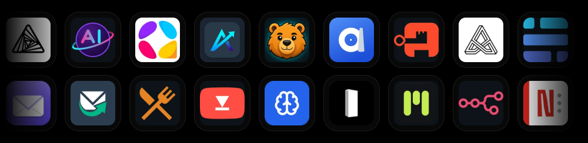
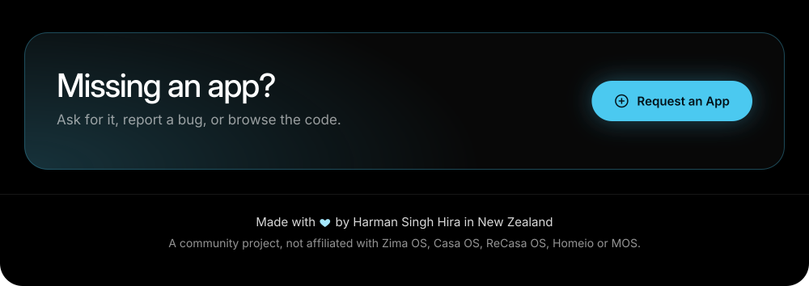

# IceStore - Zima OS / Casa OS / ReCasa OS / Homeio / MOS Third Party Community App Store

A community app store for [ZimaOS](https://www.zimaspace.com/ZimaOS), [CasaOS](https://casaos.io/), [ReCasaOS](https://github.com/ReCasaOS/CasaOS),  [Homeio](https://homeio.app/) and [MOS](https://mos-official.net/), maintained by [HSinghHira](https://github.com/HSinghHira).

Browse the apps at **[icestore.hsinghhira.me](https://icestore.hsinghhira.me/)**.

<!-- README-SVGS:START -->

<a href="https://icestore.hsinghhira.me/#stores"></a
><a href="https://icestore.hsinghhira.me/#apps"></a
><a href="https://github.com/HSinghHira/IceStore/issues/new"></a
>

<!-- README-SVGS:END -->
